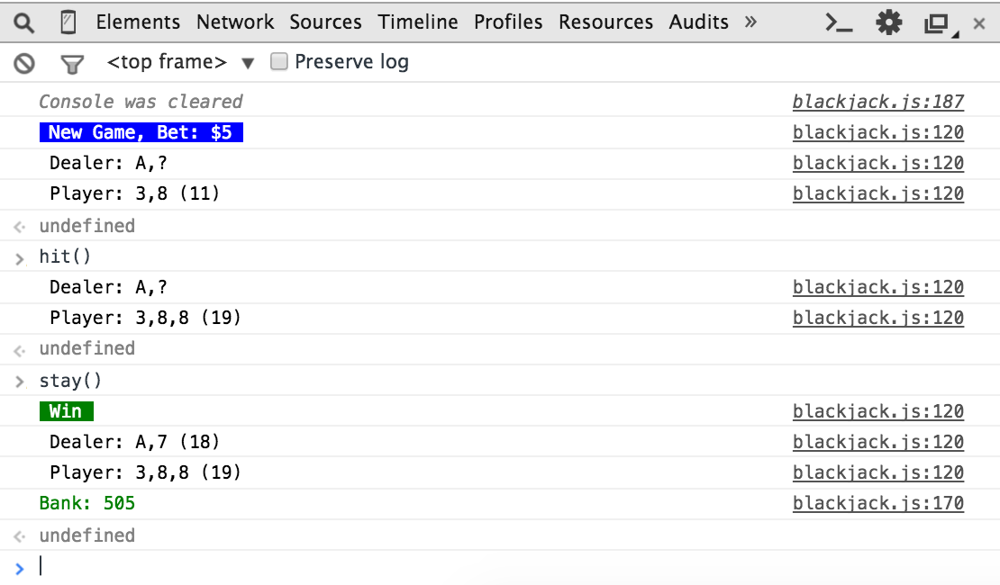

# Blackjack.js

Play blackjack in the console

## Gameplay

Settings are easy to change, but currently:

- The game plays with a six decks
- The dealer will shuffle half way though the shoe
- The game cannot yet handle splits, double downs, or insurance

## Manual Play

Use quick function calls `play()`, `hit()`, and `stay()` to play the game 

## Program an Autoplayer

Subscribe to the game's events and play with an automatic player. Currently the code has two example autoplayers. One will bet $5 no matter what, the other attempts a progressive betting strategy (and they both always lose eventually).

Feel free to program your own strategy.